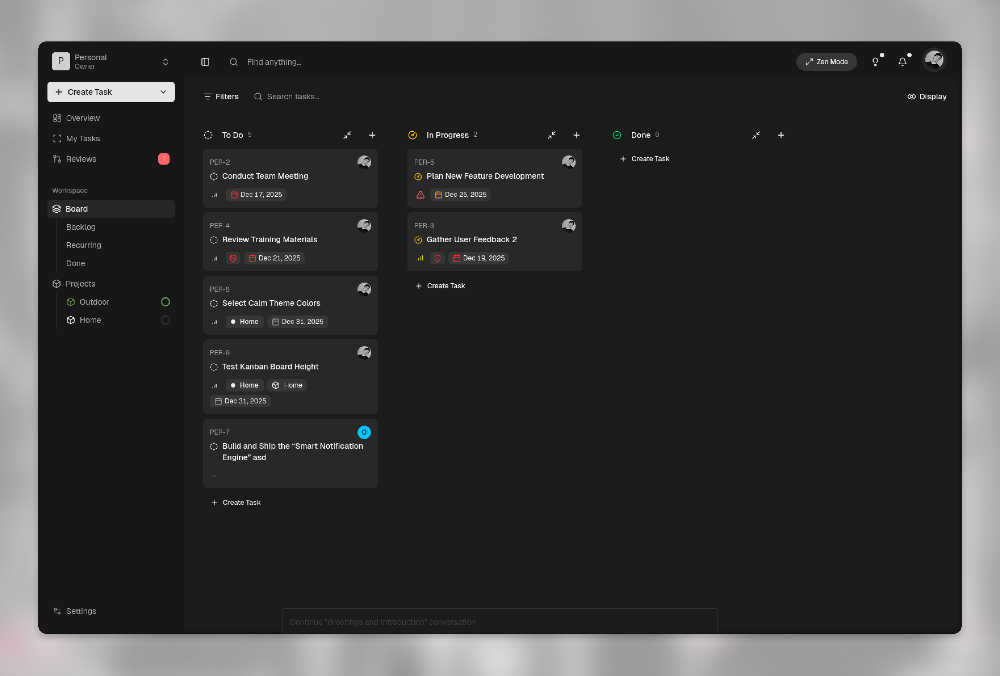

<h1 align="center"><b>Mimrai</b></h1>

Open source minimalist task management tool to track your tasks and projects with ease.

> Mimrai is an evolving project, currently in its early stages of development. Your feedback and contributions are highly valued to help shape its future.

## Architecture

- Monorepo managed with [Turborepo](https://turborepo.com/)
- Typescript
- Bun
- React
- Next.js
- Supabase
- Tailwind CSS
- Shadcn UI

## Hosting

- Supabase (database, storage, realtime)
- Vercel (website, dashboard)
- Fly.io (api)

## Services

- Trigger.dev (background jobs)
- Resend (email delivery)
- Github Actions (ci/cd)
- Upstash (redis caching)
- Sentry (error tracking)
- OpenPanel.dev (events and analytics)
- OpenAI (ai features)

## Repo Activity

## License

This project is licensed under the **[AGPL-3.0](https://opensource.org/licenses/AGPL-3.0)** for non-commercial use.

### Commercial Use

For commercial use or deployments requiring a setup fee, please contact us
for a commercial license at [ilpadronexd@gmail.com](mailto:ilpadronexd@gmail.com).

By using this software, you agree to the terms of the license.
